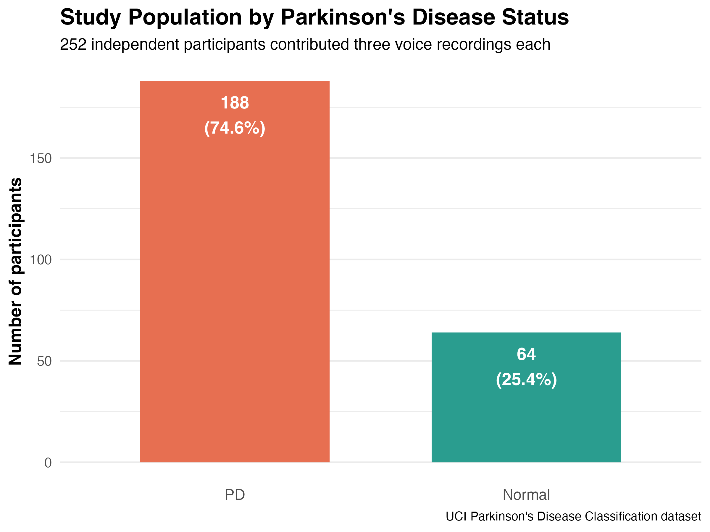
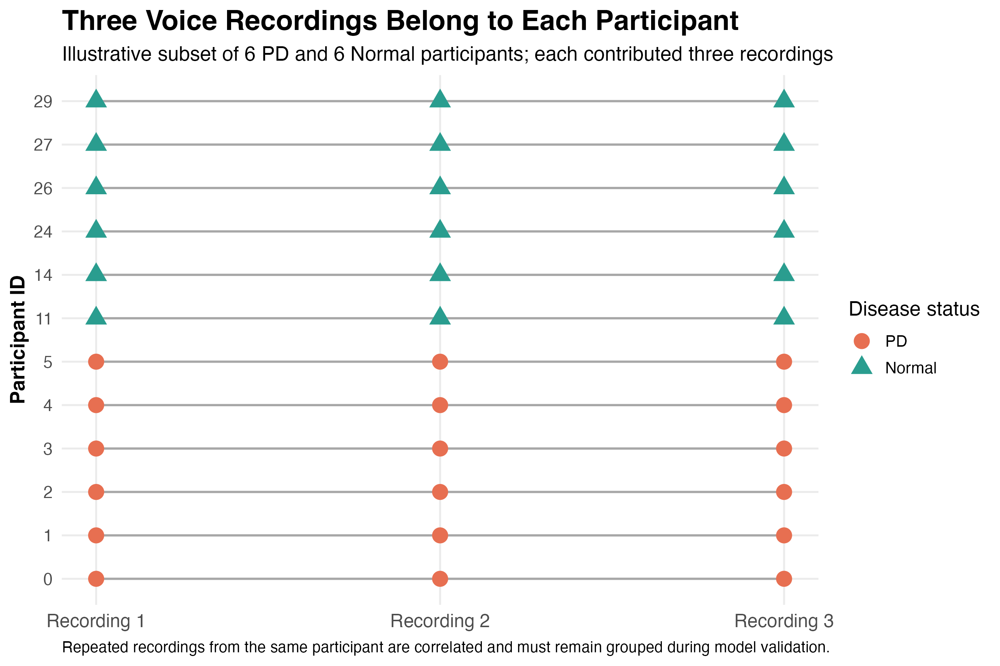
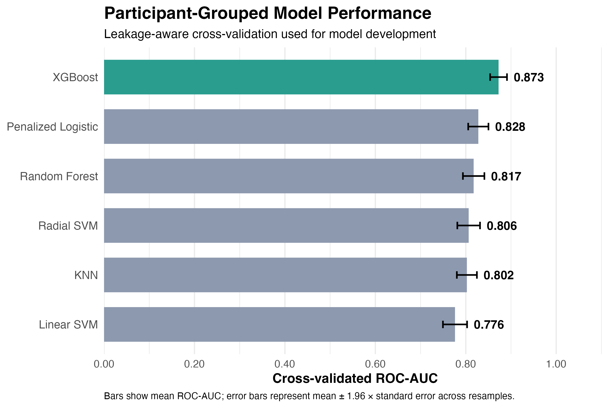
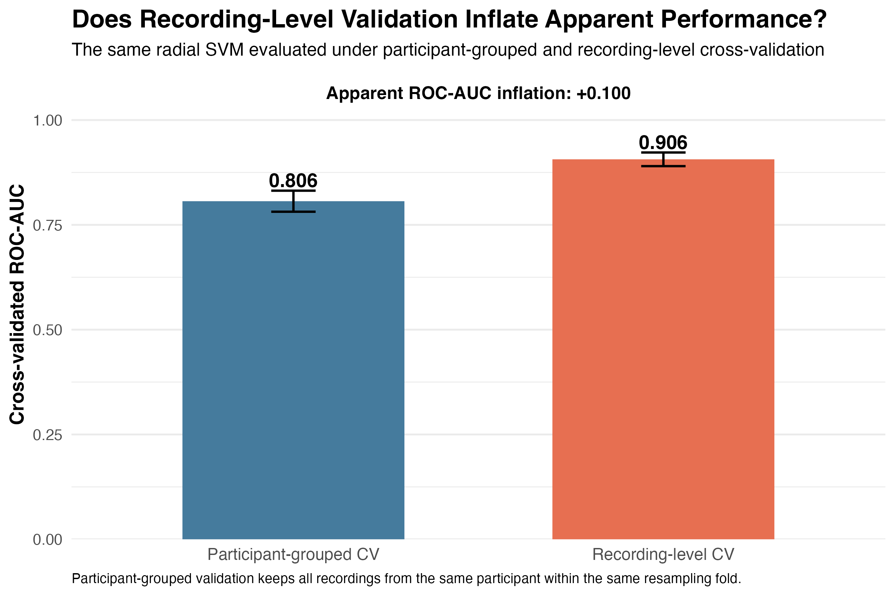
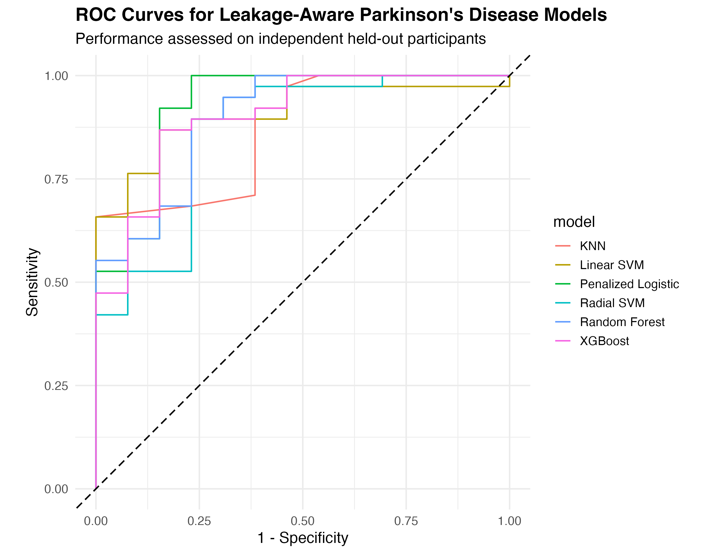
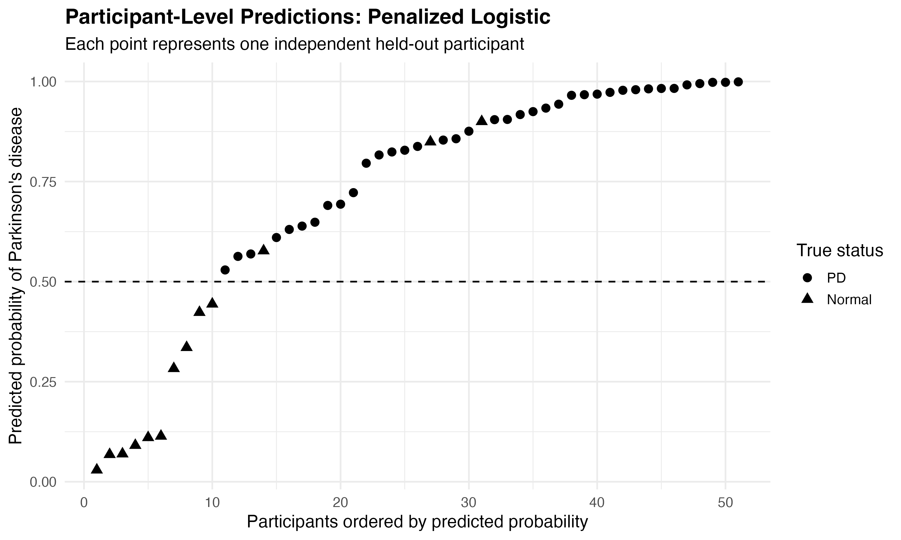
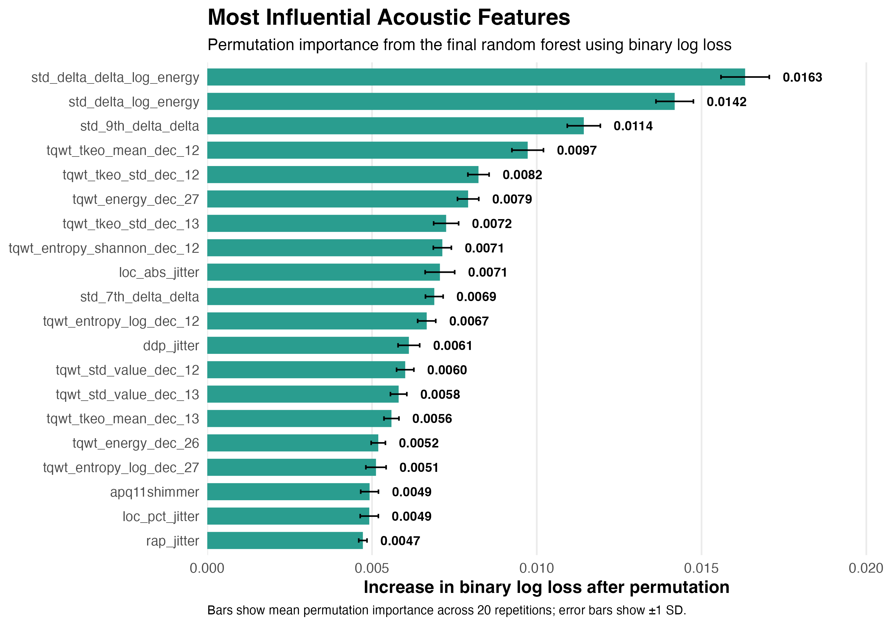

# VoiceMark PD

## Leakage-Aware Machine Learning for Parkinson's Classification from Acoustic Voice Biomarkers

VoiceMark PD is a reproducible machine-learning project evaluating whether acoustic voice features can distinguish participants with Parkinson's disease from healthy controls while explicitly addressing a major methodological risk in repeated-measures data: **participant-level information leakage**.

The analysis uses repeated voice recordings from **252 participants**, producing **756 recordings** with approximately **753 acoustic predictors**. Because each participant contributes multiple recordings, conventional recording-level data splitting can place recordings from the same person in both training and validation sets, creating artificially optimistic performance estimates.

This project therefore uses **participant-grouped data splitting and grouped cross-validation** so that all recordings from a participant remain within the same resampling partition.

---

## Why This Project Matters

Machine-learning models applied to biomedical repeated-measures data can appear highly accurate when observations from the same person are allowed to occur in both model-training and validation sets.

VoiceMark PD demonstrates this problem directly by comparing leakage-aware participant-grouped validation with conventional recording-level validation.

The project focuses not only on predictive performance, but also on whether that performance is estimated using a defensible validation design.

---

## Data

The analysis uses the **UCI Parkinson's Disease Classification Dataset**, containing acoustic voice measurements derived from repeated recordings.

### Study Structure

- **252 participants**
- **756 voice recordings**
- Approximately **753 acoustic predictors**
- Repeated recordings nested within participants
- Binary Parkinson's disease classification outcome

The source dataset is publicly available through the UCI Machine Learning Repository.

---

## Analytical Workflow

The project implements an end-to-end machine-learning workflow in **R** using the **tidymodels** ecosystem.

Major analytical steps include:

1. Data quality and participant-level structure assessment
2. Participant-grouped training and held-out test split
3. Leakage-aware repeated grouped cross-validation
4. Preprocessing estimated within resampling
5. Hyperparameter tuning and model comparison
6. Direct comparison of grouped versus recording-level validation
7. Held-out test-set evaluation
8. Participant-level probability aggregation
9. Calibration and discrimination assessment
10. Model interpretation using permutation importance

---

## Validation Design

The dataset was divided using participant identifiers rather than individual recordings.

### Train/Test Split

- **201 participants** assigned to model development
- **51 participants** reserved as an independent held-out test set
- **Zero participant overlap** between training and test data

### Cross-Validation

Model development used:

- **5-fold participant-grouped cross-validation**
- **5 repeats**
- Preprocessing learned independently within each resample

This design prevents information from one participant from contributing simultaneously to model training and validation.

---

## Models Compared

Six machine-learning approaches were evaluated using a common resampling framework.

The workflow included models representing:

- Penalized logistic regression
- K-nearest neighbors
- Linear support vector machines
- Radial support vector machines
- Random forests
- Gradient-boosted trees

Model performance was evaluated primarily using ROC-AUC alongside additional classification metrics.

---

## Key Results

### Grouped Cross-Validation

The strongest grouped cross-validation performance was obtained by **XGBoost**, with:

**ROC-AUC = 0.873**

This represents model discrimination under participant-independent validation.

### Demonstrating Repeated-Measures Leakage

A radial SVM was evaluated under both grouped and conventional recording-level cross-validation.

| Validation Design | ROC-AUC |
|---|---:|
| Participant-grouped cross-validation | **0.806** |
| Recording-level cross-validation | **0.906** |

The approximately **0.10 increase in ROC-AUC** under recording-level validation illustrates how repeated-measures leakage can substantially inflate apparent model performance.

### Independent Held-Out Test Set

On the 51 completely unseen participants, the selected penalized logistic regression model achieved:

| Metric | Performance |
|---|---:|
| ROC-AUC | **0.927** |
| Accuracy | **0.941** |
| Sensitivity | **1.000** |
| Specificity | **0.769** |

These estimates come from the independent participant-level held-out test set and should not be interpreted interchangeably with cross-validation results.

---

## Selected Visualizations

### Study Population



### Repeated-Measures Structure



### Model Comparison



### Leakage Experiment



### Held-Out ROC Performance



### Participant-Level Predictions



### Model Interpretation



---

## Technical Stack

**Language:** R

**Core Framework:** tidymodels

**Modeling and Evaluation:**  
rsample • recipes • parsnip • workflows • tune • yardstick

**Visualization:**  
ggplot2

**Interpretability:**  
DALEX

**Reproducibility:**  
R Markdown • here

---

## Repository Structure

```text
voicemark-pd/
│
├── README.md
├── VoiceMark-PD.Rproj
│
├── code/
│   └── VoiceMark_PD_Analysis.Rmd
│
├── data/
│   └── pd_speech_features.csv
│
├── docs/
│   └── VoiceMark_PD_Analysis.html
│
├── figures/
│   ├── 01_study_population.png
│   ├── 02_repeated_measures_design.png
│   ├── 03_model_leaderboard.png
│   ├── 04_leakage_comparison.png
│   ├── 05_test_roc_curves.png
│   ├── 06_precision_recall_curves.png
│   ├── 07_confusion_matrix.png
│   ├── 08_participant_probabilities.png
│   ├── 09_calibration.png
│   ├── 10_roc_pr_combined.png
│   └── 11_dalex_feature_importance.png
│
└── tables/
    ├── 01_subject_class_distribution.csv
    ├── 02_train_test_split.csv
    ├── 03_cross_validation_metrics.csv
    ├── 04_leakage_comparison.csv
    ├── 05_final_test_metrics.csv
    ├── 06_subject_predictions.csv
    └── 07_dalex_feature_importance.csv

---

## Reproducibility

The project uses an RStudio project root together with the `here` package so that data, figures, and tables are referenced using project-relative paths rather than machine-specific absolute directories.

To reproduce the analysis:

1. Clone the repository.
2. Open `VoiceMark-PD.Rproj` in RStudio.
3. Ensure the required R packages are installed.
4. Open `code/VoiceMark_PD_Analysis.Rmd`.
5. Run or knit the analysis from the project root.

The source dataset is stored in:

    data/pd_speech_features.csv

Generated analytical outputs are written to the `figures/` and `tables/` directories.

---

## Interpretation

The project demonstrates that high predictive accuracy alone is insufficient evidence of a robust biomedical machine-learning model.

When multiple observations originate from the same participant, validation procedures must preserve participant independence. Otherwise, models can partially recognize participant-specific characteristics rather than learn relationships that generalize to genuinely unseen individuals.

The direct grouped-versus-recording-level comparison in VoiceMark PD illustrates the practical magnitude of this problem.

---

## Limitations

This project is an analytical and methodological demonstration rather than a clinical diagnostic system.

Key limitations include:

- Use of a single publicly available dataset
- Moderate participant sample size
- High-dimensional acoustic feature space
- Lack of prospective external validation
- No assessment of real-world clinical deployment
- No device-level or regulatory validation
- Potential dataset-specific performance characteristics

Results should therefore be interpreted as evidence of predictive and methodological performance within this dataset, not as proof of clinical diagnostic utility.

---

## Key Takeaway

**VoiceMark PD shows how participant-aware validation can materially change the apparent performance of machine-learning models built from repeated biomedical measurements.**

The project combines predictive modeling with rigorous validation design, reproducibility, interpretability, and explicit investigation of data leakage.

---

## Author

**Kenechukwu Nwosu**

Research interests include epidemiology, real-world evidence, health outcomes research, clinical research, biomedical data science, and applied machine learning.